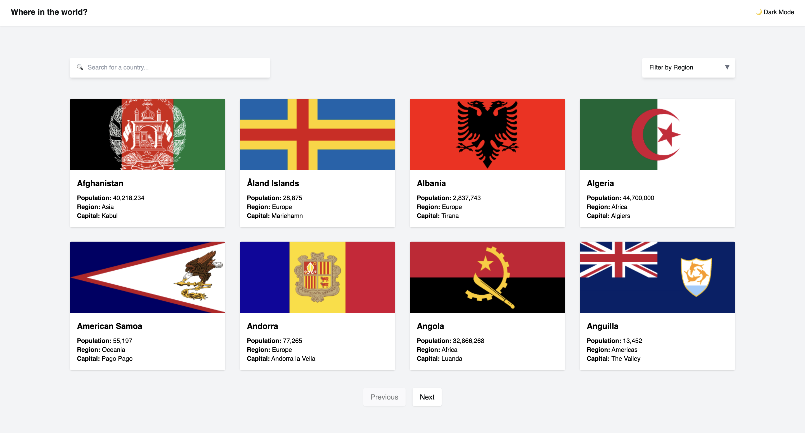
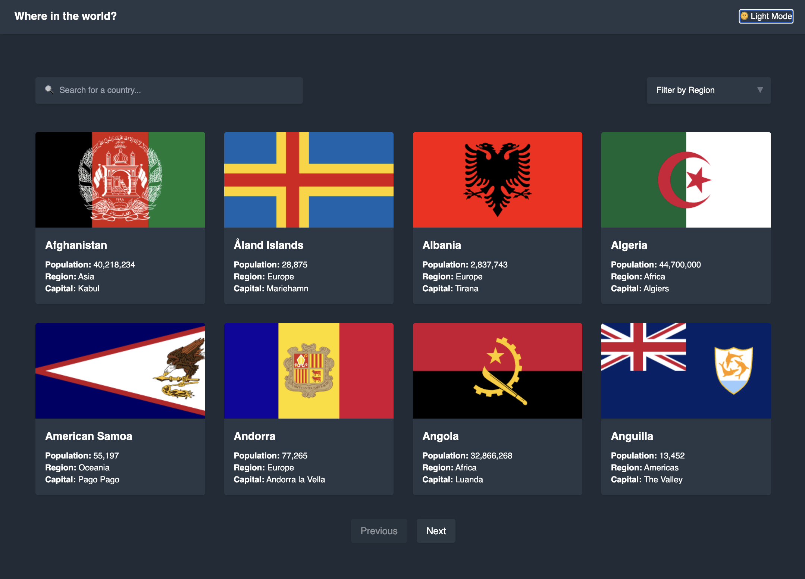
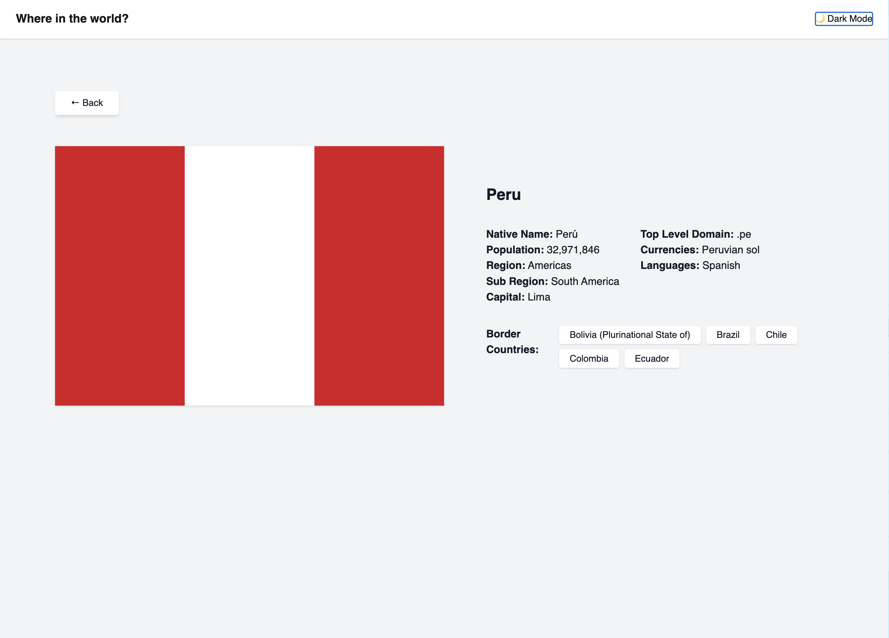
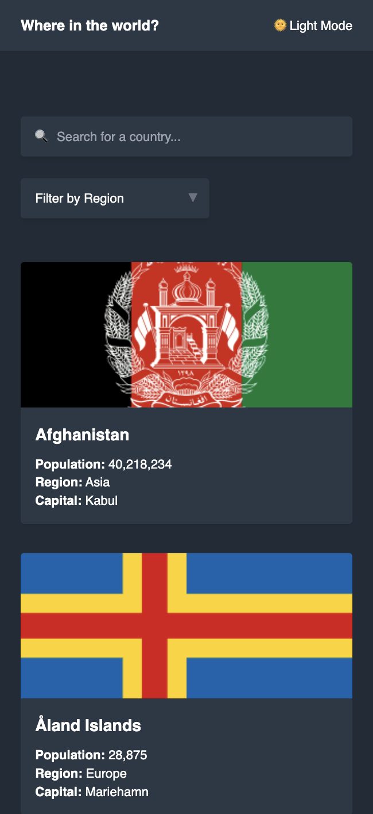

# 🌍 Country App Challenge

A responsive and elegant application to explore countries around the world.  
Built as part of the [Frontend Mentor Challenge](https://www.frontendmentor.io/challenges/rest-countries-api-with-color-theme-switcher-48f6e9c3), this project allows users to search for countries, filter by region, and view detailed information with a dark/light theme switcher.

🔗 **Live Demo:** [https://countryappchallenge.netlify.app](https://countryappchallenge.netlify.app)

---

## 🖼️ Preview

### 🏠 Home – Light Mode

### 🌙 Home – Dark Mode

### 📄 Country Detail

### 📱 Mobile Responsive View

---

## 🚀 Tech Stack

- ✅ Vue 3 (Composition API + TypeScript)
- 🎨 TailwindCSS
- 🌐 Vue Router
- 🔄 REST Countries API v3.1
- 📦 Vite

---

## 🧩 Features

- 🌙 Light / Dark theme switcher
- 🔍 Search countries by name
- 🌍 Filter by region
- 📄 Country detail view via dynamic routing (`/country/:code`)
- 📱 Fully responsive layout
- ⚡ Optimized with only required fields from the API

---

## 📁 Project Structure

\`\`\`
src/
├── assets/
├── components/
│ └── CountryCard.vue
├── views/
│ └── CountryDetail.vue
├── models/
│ └── country.model.ts
├── router/
│ └── index.ts
├── utils/
│ └── axios.ts
├── App.vue
└── main.ts
\`\`\`

---

## 🛠️ Setup & Run Locally

\`\`\`bash

# 1. Clona el repositorio

git clone https://github.com/frontsitoz/countries-app-ui.git
cd countries-app-ui

# 2. Instala dependencias

npm install

# 3. Corre en desarrollo

npm run dev

# 4. Genera build para producción

npm run build
\`\`\`

---

## 🌐 API Used

This project uses [REST Countries API v3.1](https://restcountries.com/) with `?fields=` query parameters to request only the necessary data:

\`\`\`ts
GET /all?fields=name,flags,capital,population,region
\`\`\`

---

## 📄 License

This project is open-source and available under the [MIT License](LICENSE).

---

## ✨ Author

Desarrollado por **[Alvaro Prado]**  
🔗 [LinkedIn](https://www.linkedin.com/in/alvaro-prado-tenorio/)
